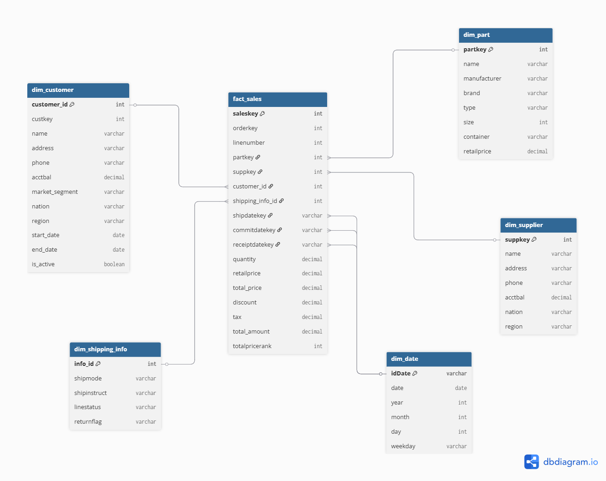

# **ELT Project: Retail Sales Analytics**
## **1. Introduction**
In this project, I analyze data related to **retail sales and supply chain management**. The goal of the analysis is to understand:
- **Sales trends** and revenue growth.
- **Customer behavior** and market segments.
- **Logistics performance**.
  
The data comes from the standard **TPC-H dataset** (`snowflake_sample_data.tpch_sf10`) available in Snowflake. It simulates a global business and includes these main tables

- `ORDERS` – Order details (who, when, priority).
- `LINEITEM` – Transaction items (products, prices, discounts).
- `CUSTOMER` – Customer demographics.
- `SUPPLIER` – Supplier information.
- `PART` – Product catalog.
- `NATION / REGION` – Geographic locations.

---
### **1.1 Data Architecture**

### **ERD Diagram**
The raw data is organized in a relational model, represented by the diagram:

<p align="center">
  
  <br>
  <em>Figure 1: Entity-Relationship Schema for TPC-H dataset</em>
</p>

---
## **2. Dimensional Model**

A **Star Schema** was designed for this project following Kimball's methodology. It contains one fact table, **`fact_sales`**, which is connected to the following 5 dimensions:
- **`dim_customer`**: Customer details and location. Implemented as **SCD Type 2** to track historical changes.
- **`dim_part`**: Product attributes (brand, size, manufacturer).
- **`dim_supplier`**: Supplier name and location.
- **`dim_date`**: A **role-playing dimension** used for Shipping, Commitment, and Receipt dates.
- **`dim_shipping_info`**: Logistics details (shipping modes, return flags).

The structure of the Star Schema is illustrated in the diagram below.

<p align="center">
  
  <br>
  <em>Figure 2: Star Schema</em>
</p>

---
## **3. ELT Process in Snowflake**
The ELT process consists of three main phases: `Extract`, `Load`, and `Transform`. The project follows an **ELT (Extract, Load, Transform)** workflow in Snowflake.

---
### **3.1 Extract**
Data for this project was extracted from the Snowflake Sample Database (`SNOWFLAKE_SAMPLE_DATA.TPCH_SF10`). The extraction process involved setting up the warehouse, database, and schema to host the project data:

#### Code Example:
```sql
-- connecting to warehouse
use warehouse gator_wh;
-- connecting to database
use database gator_db;
-- creating schema for project
create schema lab_project1;
use schema lab_project1;
```

---
### **3.2 Load**

Raw data was transferred from the SNOWFLAKE_SAMPLE_DATA database into local staging tables.

#### Code Example:
```sql
create table part_staging as
select * from snowflake_sample_data.tpch_sf10.part;
```

---
### **3.3 Transform**

In this phase, data from the staging tables was cleaned, transformed, and enriched. The main goal was to prepare dimensions and the fact table to enable simple and effective analysis.

Dimensions were designed to provide context for the fact table. `Dim_customer` contains customer data including market segment, account balance, and geographical location (Nation, Region). This dimension is implemented as **SCD Type 2**, allowing tracking of profile changes (using `start_date`, `end_date`, and `is_active` flag).

#### Code Example:
```sql
create or replace table dim_customer as
select
-- adding customer_id, because custkey is not unique in scd type 2
row_number() over(order by c_custkey) as customer_id,
c_custkey as custkey,
c_name as name,
c_address as address,
c_phone as phone,
c_acctbal as acctbal,
c_mktsegment as market_segment,
n_name as nation,
r_name as region,
-- adding start_date, end_date and is_active to transform table into scd type 2
to_date('1900-01-01') as start_date,
to_date(null) as end_date,
true as is_active
from customer_staging;
```

The `dim_date` dimension is designed to store all unique dates found in the shipment, commitment, and receipt events. It contains derived attributes such as day, month, year, and weekday. This dimension is **SCD Type 0**. It is joined to the fact table three times to represent the Ship Date, Commit Date, and Receipt Date.


#### Code Example:
```sql
create or replace table dim_date as
select distinct 
to_char(date(d.event_date), 'YYYYMMDD') as idDate,
date(d.event_date) as date,
year(d.event_date) as year,
month(d.event_date) as month,
day(d.event_date) as day,
dayname(d.event_date) as weekday
from distinct_dates d;
```

Other dimensions include dim_part and dim_supplier, which provide context about the products sold and their manufacturers. Additionally, a dim_shipping_info table was created to handle combinations of shipping modes and instructions.

#### Code Example:
```sql
create or replace table dim_part as
select
p_partkey as partkey,
p_name as name,
p_mfgr as manufacturer,
p_brand as brand,
p_type as type,
p_size as size,
p_container as container,
p_retailprice as retailprice
from part_staging;
```

#### Code Example:
```sql
create or replace table dim_supplier as
select
s_suppkey as suppkey,
s_name as name,
s_address as address,
s_phone as phone,
s_acctbal as acctbal,
n_name as nation,
r_name as region
from supplier_staging;
```

#### Code Example:
```sql
create or replace table dim_shipping_info as
select 
-- using window function to assign id for each unique combination
row_number() over (order by  l_shipmode,
l_shipinstruct, l_linestatus, l_returnflag) as info_id,
-- 
l_shipmode as shipmode, 
l_shipinstruct as shipinstruct, 
l_linestatus as linestatus, 
l_returnflag as returnflag
from(
select distinct l_shipmode, l_shipinstruct, l_linestatus, l_returnflag
from lineitem_staging
); 
```
The ELT process in Snowflake transformed the normalized source data into a  Star Schema. This process included cleaning, enriching, and denormalizing the data. The resulting model allows complex analysis of sales trends, logistics performance, and customer behavior.

After creating the dimensions and the fact table, the staging tables were removed to optimize storage usage:


#### Code Example:
```sql
drop table if exists lineitem_staging;
drop table if exists order_staging;
drop table if exists customer_staging;
drop table if exists supplier_staging;
drop table if exists part_staging;
```
---
## **4. Data Visualization**

The dashboard contains **6 visualizations** that provide a comprehensive overview of key metrics and trends regarding sales performance, supply chain efficiency, and customer behavior. These visualizations answer important business questions and help better understand logistics reliability and revenue drivers.


---
### **Graph 1: distribution of orders delivered on time, early, and late**
Shows the percentage of orders delivered early, on time, or late. This is a key metric for logistics performance.

```sql
select case 
when r_date.date < c_date.date then 'early' 
when r_date.date = c_date.date then 'on time' 
when r_date.date > c_date.date then 'late'
end delivery_status,
count(*) as total_count
from fact_sales f
join dim_date c_date 
on f.commitdatekey = c_date.iddate
join dim_date r_date 
on f.receiptdatekey = r_date.iddate
group by delivery_status
order by delivery_status;
```
---
### **Graph 2: total revenue by discount category**
Compares revenue across different discount tiers. This helps identify the most profitable pricing strategy.

```sql
select case 
when f.discount = 0 then 'no discount'
when f.discount between 0.01 and 0.03 then 'low (1-3%)'
when f.discount between 0.04 and 0.07 then 'medium (4-7%)'
when f.discount > 0.07 then 'high (>7%)'
end discount_category,
sum(f.total_amount) total_revenue
from fact_sales f
group by discount_category
order by total_revenue desc;
```
---
### **Graph 3: monthly revenue in 1992**
Shows the total sales trend month-over-month for the year 1992 to identify seasonal patterns.

```sql
select d.month, sum(f.total_amount) as monthly_revenue
from fact_sales f
join dim_date d 
on f.shipdatekey = d.iddate
where d.year = 1992
group by d.month
order by d.month;
```
---
### **Graph 4: the number of orders grouped by their value**
A histogram showing how many orders fall into specific value ranges.

```sql
select case 
when total_amount < 50000 then '0. <50k'
when total_amount between 50000 and 100000 then '1. 50k-100k'
when total_amount between 100000 and 150000 then '2. 100k-150k'
when total_amount between 150000 and 200000 then '3. 150k-200k'
when total_amount between 250000 and 300000 then '4. 250k-300k'
when total_amount > 300000 then '5. >300k'
end order_category, count(*) number_of_orders
from fact_sales
where total_amount is not null
group by order_category
order by order_category;
```
---
### **Graph 5: top best-selling products**
Lists the most popular items based on total quantity sold.

```sql
select p.name as product_name, sum(f.quantity) as total_sold
from fact_sales f
join dim_part p 
on f.partkey = p.partkey
group by p.name
order by sum(f.quantity) desc
limit 5;
```
---
### **Graph 6: distribution of delivery delays**
Shows the exact number of days orders were delayed or early. This helps spot outliers in the supply chain.

```sql
select datediff(day, c_date.date, r_date.date) days_late,
count(*) total_orders
from fact_sales f
join dim_date c_date 
on f.commitdatekey = c_date.iddate
join dim_date r_date 
on f.receiptdatekey = r_date.iddate
group by days_late
order by days_late;
```


---

**Author:** Dmitrii Kalashnikov
